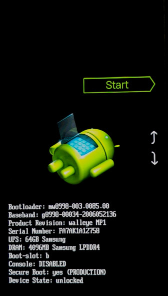

### What is fastboot?

Fastboot is a special administrative mode of your Android device. Once in fastboot mode, your host computer can send commands to the device to install a new operating system.

### How to enter fastboot?

**Method 1**

1. Power off the Android device.
2. Hold the **volume down** button.
3. Connect a USB cable to the host computer.

The device should automatically power on into fastboot mode.

**Method 2**

1. Power off the Android device.
2. Hold the **volume down** button.
3. Hold the **power** button.
4. Wait for a slight vibration.
5. Release the **power** button.
6. When the fastboot screen appears, release the **volume down** button.

### How to use fastboot

For the purpose of installing CalyxOS, you don't need to do anything on the fastboot screen.

If you do want to select one of the options, use the **volume** buttons to change the selected action, and the **power** button to trigger the action.

### What does fastboot screen look like?

If you don't see this screen, you are not in fastboot. Restart and try again.

Your fastboot screen may be slightly different.

Pixel screen:

Xiaomi screen:

